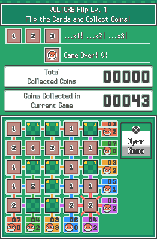

# Voltorb Flip
This is an open source faithful recreation of VOLTORB Flip from Pokémon HeartGold and SoulSilver written in typescript (a superset of javascript). None of the code is commented (sorry) but I'm open to pull requests if you have a bug fix or feature. Thanks.

# Features
## Levels
Levels are fully supported as they appear in the original game. If the player successfully finds all 2s and 3s, they advance one level, and if the player turns over a voltorb before flipping at least the current level number of tiles, they are dropped back to level 1, other wise they stay on the current level

Winning 5 levels in a row will also take the player straight to level 8 just like the original game.

## Memos
The memo menu is opened and closed by pressing the Open/Close Memo button. Selecting or unselecting a memo in the memo menu highlights or unhighlights that memo on the currently selected tile.

There are two features related to memos that do not appear in the original game however that were added for convenience. The first feature is that when only 1 memo is selected on a tile, a big version of that memo is highlighted instead of a tiny version in one of the corners. The second extra feature is the repeat/recurse option in the memo menu. This is not a back/close button. Highlighting this and selecting a new tile copies over the selected memos.

## Mass Flipping/Highlighting
It is possible to flip or highlight a whole row or column at once by holding Ctrl on the keyboard, holding down the left mouse button, and dragging the curser across tiles to flip or highlight them all at once.

## Coin Total
Coins are counted up across all games however the score is reset upong refreshing the page (at the moment).

# Future Features
## Scoreboard
I intend to add a global scoreboard that keeps track of people's scores before hitting level 1 again. Upon hitting level 1, the game would ask for a nickname like a classic arcade game, and then display their chosen nickname and score in the scoreboard.

## Keyboard Controls
Currently the game requires a mouse or trackpad to play, but I intend to make the whole game playable from a keyboard using arrow keys and such.

## Dedicated Engine
Although this isn't a visible change, I am working on a dedicated HTML5 Engine designed around the canvas element and based on this project. I can then strip away much of the unrelated code to make working on this project simpler.

# Compilation
This project requires and uses Node and NPM (which comes with Node). If you're on Windows, you can download the installer [here](https://nodejs.org), otherwise install Node from your preferred package manager.

Compiling will produce a website in the dist folder of the project. To "run" the game, open the `index.html` file found in the dist folder in your preferred browser.

## Linux
To build the project on a linux machine, open a command line in the project folder, and run `npm run build`.

## Windows
Building on a Windows machine is only slightly different, open a command line in the project folder, and run `npm run win-build`.

The reason for the difference is that the folder is deleted and recreated upon compilation to clean up left over files unneccisary files from a previous compilation.

## Debugging
If you are writing a feature or fixing a bug and are incrementally testing changes and don't want to have to recompile the whole project every five seconds you can instead a primitive debug mode.

Enter the project folder in a command line, and run `npm run watch`. This command works on any OS since no folder is being deleted. Every time a change is detected in the code, parts of the project are automatically recompiled.

# Modifying
The core of the project is a single script found at `voltorb-flip/src/index.ts`. If you want to make a change, this is where you'd do it. I put assets that aren't code like images and music in `voltorb-flip/src/assets/.`.
